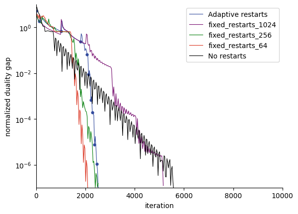

# Implementation

## Targets

原问题

$$\min_{x\ge 0}\max_{y} {\mathcal L}(x,y) = c^\top x+y^\top b-y^\top Ax.$$

$$
F(z)= \begin{pmatrix}
 \nabla_x {\cal L}(x,y)\\
 -\nabla_y {\cal L}(x,y)
\end{pmatrix}
=\begin{pmatrix}
 c-A^\top y\\
 Ax-b
\end{pmatrix}
$$

### PrimalDualStep

- [ ] PPM 解鞍点问题

- [ ] EGM 解二次优化问题

迭代公式：

$$
\begin{align*}
& \hat z^{t+1} ={\rm Proj}_Z ( z^t-\eta F(z^t) )\\
& z^{t+1}={\rm Proj}_Z(z^t-\eta F(\hat z ^{t+1}))
\end{align*}
$$

- [ ] PDHG 解二次优化问题

迭代公式

$$
\begin{align*}
& x^{t+1}=(x^t -\eta /w (c-Ay))_+\\
& y^{t+1}=y-\eta w (-b+A(2x^{t+1}-x^t))
\end{align*}
$$

- [ ] ADMM

$$
\theta_1=0, \theta_2(x_V)=c^\top x_V\\
U=I,V=-I,q=0\\
x_U^{t+1}=A^\top(AA^\top)^{-1}(b+A(-x_V^t-\frac1\eta y^t ))\\
x_V^{t+1}=x_U-\frac 1\eta y^t-\frac 1\eta c
$$

### normalized duality gap

$$
\begin{align*}
& \rho_r(z):=\frac{\max_{\hat{z}\in W_r(z)  }\{{\cal L}(x,\hat y)- {\cal L}(\hat x,y)\}}{r}\\
& W_r(z):=\{\hat z \in Z\mid \|z-\hat z \|\le r \}
\end{align*}
$$

若

$$
{\cal L}(x,y)=c^\top x+y^\top b-y^\top Ax,\quad x\ge 0,y\in \R^m
$$

求在$z$处的$\rho(z)$即要求一个二次约束线性目标函数的优化问题，这是QCQP

具体地
$$
\begin{align*}
{\cal L}(x,\hat y)-{\cal L}(\hat x,y)&=c^\top x+\hat y ^\top b-\hat y ^\top Ax -(c^\top \hat x+y^\top b -y^\top A \hat x)\\
&=\hat y ^\top (b-Ax) +(y^\top A-c^\top)\hat x +c^\top x -y^\top b
\end{align*}
$$

- 当$Z=\R^{m+n}$时，

$$
\rho_r(z)=\|F(z)\|=\left \|
\begin{pmatrix}
\nabla_x{\cal L}(x,y)\\
-\nabla _y {\cal L}(x,y)\\
\end{pmatrix}\right \|
$$

- 而对标准线性规划$Z=X\times Y,X\in\R^m_+$，则需使用数值算法求值

### Restart

#### Adaptive

## Results

Dependencies: Gurobi, Eigen3

|          | PDHG | EGM  | ADMM |
| -------- | ---- | ---- | ---- |
| qap10    |      |      |      |
| qap15    |      |      |      |
| nug8-3rd | √    |      |      |
| nug20    |      |      |      |

### PDHG

|                                                              |      |
| ------------------------------------------------------------ | ---- |
|  |      |

### EGM

### ADMM（目前的实现较慢）

#### qap15

参考目标函数值：`1040.99`

#### qap10

参考目标函数值：`340`

使用gurobi解二次优化更新$x_U$

通过解析解更新，（使用`Eigen::SparseLU`解线性方程组）

## Related links

[Mathematical background for PDLP  | OR-Tools  | Google for Developers](https://developers.google.com/optimization/lp/pdlp_math)

[google-research/FirstOrderLp.jl: Experimental first-order solvers for linear and quadratic programming. (github.com)](https://github.com/google-research/FirstOrderLp.jl)

https://github.com/google-research/google-research/tree/master/restarting_FOM_for_LP

